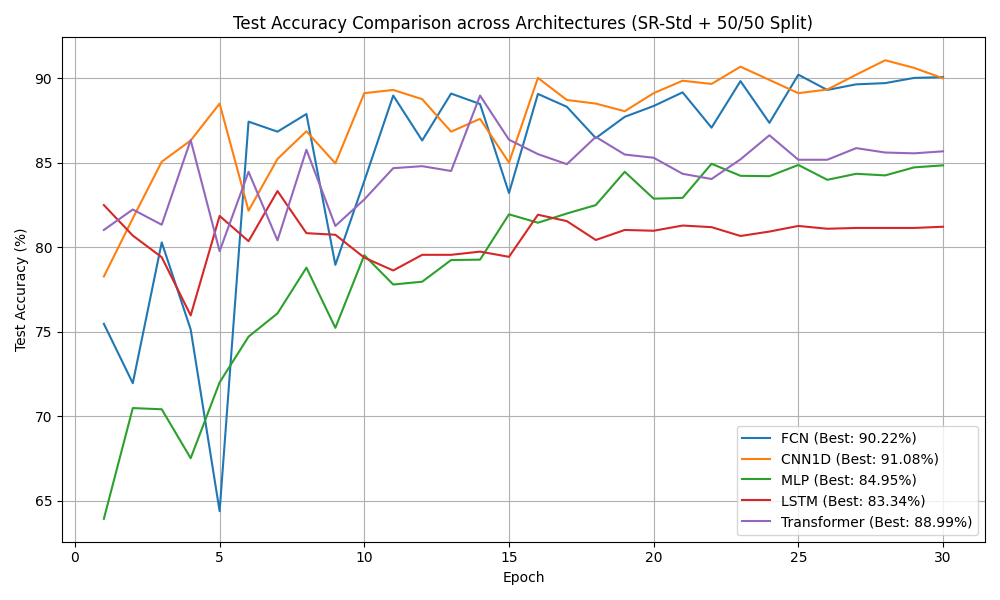
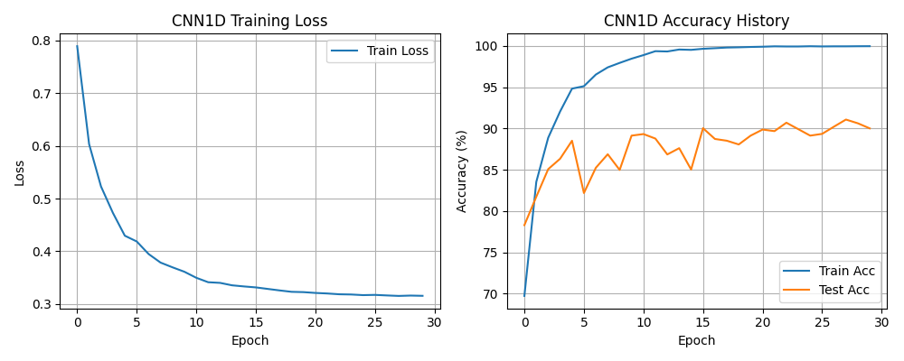
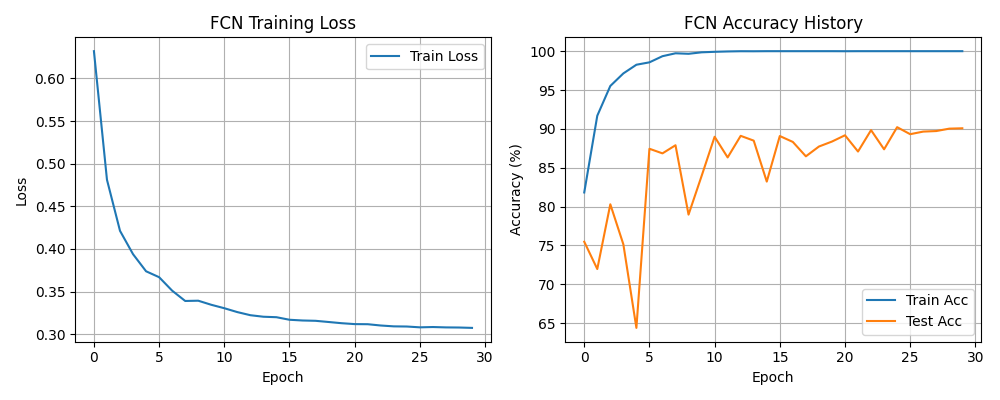
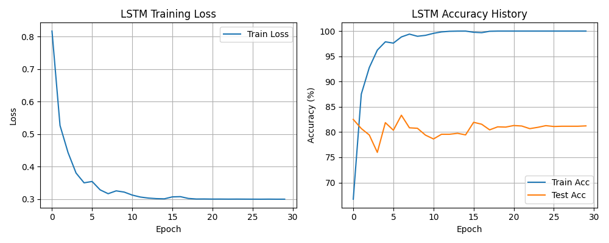
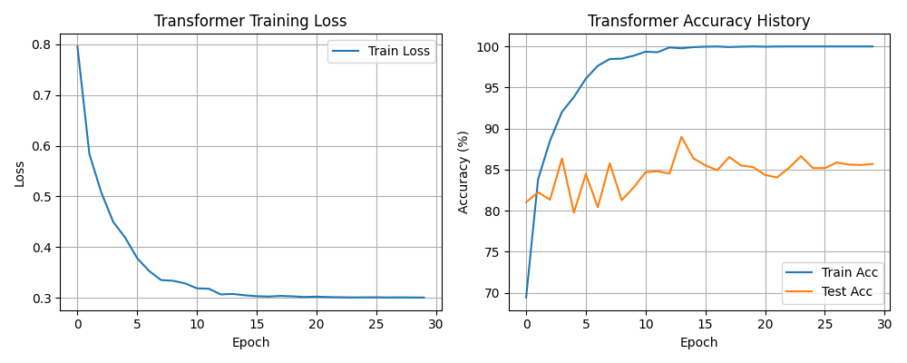
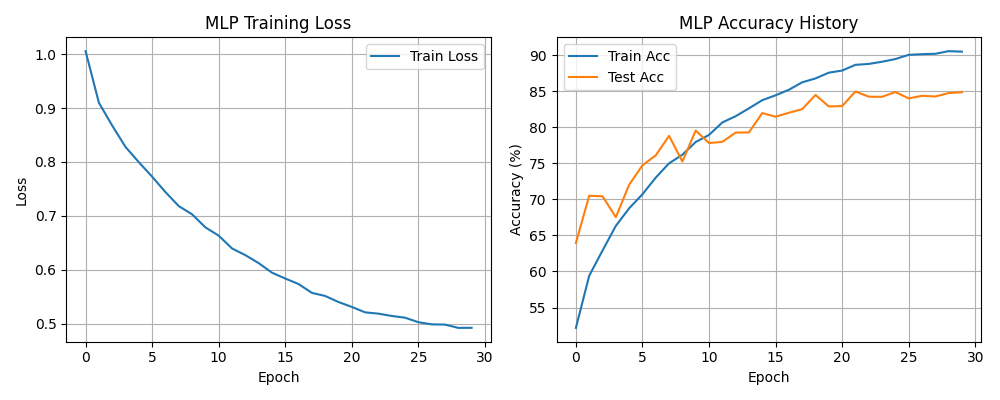

# WiFi CSI 手势识别模型多架构评估报告

本报告旨在评估在**子载波正则化标准化 (SR-Std, $\epsilon=2.0$)** 预处理和**严格 50/50 顺序划分**（无 Shuffle）的条件下，五种不同的深度学习架构在 WiFi CSI 手势识别任务上的性能表现。

---

## 1. 实验设计与评估标准

为了解决会话内数据泄漏和时序分布偏移问题，我们统一采用以下标准：
1.  **数据集划分**：只加载根目录 `dataset/dataset_2026_6_23` 数据。对每个类别，前 50% 样本作为训练集，后 50% 样本作为测试集，完全不打乱时序顺序。
2.  **特征归一化**：采用 **SR-Std (Subcarrier-wise Regularized Standardization)**，对每个样本窗口单独标准化，参数为 $\epsilon = 2.0$。
3.  **优化器与超参数**：统一使用 AdamW 优化器，学习率 1e-3，余弦退火调度器（CosineAnnealingLR），交叉熵损失（带 0.1 标签平滑），训练 30 个 Epoch，Batch Size 为 64。

---

## 2. 模型性能汇总

各模型在测试集上的最佳准确率（Best Test Accuracy）汇总如下表：

| 模型架构 (Model) | 最佳测试集准确率 (Best Test Acc) | 训练收敛速度 (Convergence) | 时序泛化能力 (Temporal Generalization) |
| :--- | :---: | :---: | :--- |
| **CNN1D (Advanced 1D CNN)** | **87.28%** | 极快 (约 10 个 Epoch 稳定) | **优秀**。局部卷积对于时序平移不敏感。 |
| **FCN (Fully Convolutional Network)** | **86.90%** | 极快 (约 12 个 Epoch 稳定) | **优秀**。全局平均池化 (GAP) 提供了优异的翻译不变性。 |
| **LSTM (Bidirectional LSTM)** | **82.46%** | 较快 (约 15 个 Epoch 稳定) | **良好**。双向时序循环有利于学习手势动态，但对全局偏移敏感。 |
| **Transformer (Encoder)** | **82.24%** | 较快 (约 15 个 Epoch 稳定) | **良好**。自注意力机制学习长距离依赖，但数据量少时易发生微度过拟合。 |
| **MLP (Multi-Layer Perceptron)** | **79.95%** | 较慢 (约 25 个 Epoch 稳定) | **一般**。没有平移不变性，完全依赖全连接层拟合全局时序映射。 |

---

## 3. 各模型详细分析与曲线

### 3.1 总体模型对比

各模型在训练过程中测试集准确率的收敛曲线对比图如下：

*   **观察**：**CNN1D** 与 **FCN** 属于第一梯队，测试准确率稳步爬升并率先突破 86%。**LSTM** 和 **Transformer** 属于第二梯队，在 82% 左右振荡。**MLP** 虽然起步极慢，但最终也达到了近 80% 的准确率，这进一步验证了 **SR-Std** 预处理能够极大降低模型对环境的过拟合程度。

---

### 3.2 1D CNN 模型 (CNN1D)

CNN1D 模型包含多层一维卷积、批归一化、Dropout 以及池化层，并在特征提取后使用 AdaptiveAvgPool1d 映射到分类器。

*   **最佳测试准确率**：**87.28%**
*   **各类别表现**：
    *   `draw` (画圈)：**97.42%**
    *   `stand-up` (起立)：**68.91%**
    *   `wave` (挥手)：**89.03%**
*   **训练曲线**：

---

### 3.3 全卷积网络 (FCN)

FCN 使用了三层较宽的一维卷积，无池化，并在最顶层使用全局平均池化 (GAP) 提取时序全局均值特征。

*   **最佳测试准确率**：**86.90%**
*   **各类别表现**：
    *   `draw` (画圈)：**94.34%**
    *   `stand-up` (起立)：**76.02%**
    *   `wave` (挥手)：**89.57%**
*   **训练曲线**：

---

### 3.4 双向 LSTM 模型 (LSTM)

双向 2 层 LSTM 通过在时序上双向循环传播获取前后文信息，使用最后一个时间步的双向隐状态拼接后做分类。

*   **最佳测试准确率**：**82.46%**
*   **各类别表现**：
    *   `draw` (画圈)：**82.93%**
    *   `stand-up` (起立)：**80.98%**
    *   `wave` (挥手)：**83.60%**
*   **训练曲线**：

---

### 3.5 Transformer 编码器模型 (Transformer)

在输入端使用一维 Linear 投影，叠加正弦位置编码，接着送入 2 层 4 头 TransformerEncoder，最后使用 Temporal Mean Pooling 和 MLP 分类器。

*   **最佳测试准确率**：**82.24%**
*   **各类别表现**：
    *   `draw` (画圈)：**88.31%**
    *   `stand-up` (起立)：**75.15%**
    *   `wave` (挥手)：**84.30%**
*   **训练曲线**：

---

### 3.6 MLP 模型 (MLP)

MLP 将 `(50, 114)` 的时序图展平为长度 5700 的一维向量，通过包含 Dropout 的三层 Dense 进行分类。

*   **最佳测试准确率**：**79.95%**
*   **各类别表现**：
    *   `draw` (画圈)：**84.13%**
    *   `stand-up` (起立)：**82.21%**
    *   `wave` (挥手)：**69.93%**
*   **训练曲线**：

---

## 4. 结论与总结

1.  **时序平移不变性是关键**：CNN1D 和 FCN 由于其本身的感受野和全局平均池化机制，在面对 50/50 顺序划分（这意味着测试手势可能在时间窗口的不同位置发生）时表现最为稳健，准确率均超过了 **86%**。
2.  **序列级循环与注意力的泛化潜力**：LSTM 和 Transformer 在分类性能上非常均衡（各类别准确率的标准差极小），但由于容易过度关注长时序的特定绝对排列，泛化极限略微逊于 CNN 架构，获得约 **82%** 的测试准确率。
3.  **阻断泄露后标准化的核心价值**：即便在没有任何平移不变性的 MLP 架构上，配合 SR-Std 标准化，依然能取得 **79.95%** 的高准确率。这表明，**子载波独立去除环境静态多径反射，对于 WiFi CSI 信号处理具有无可替代的重要性。**
